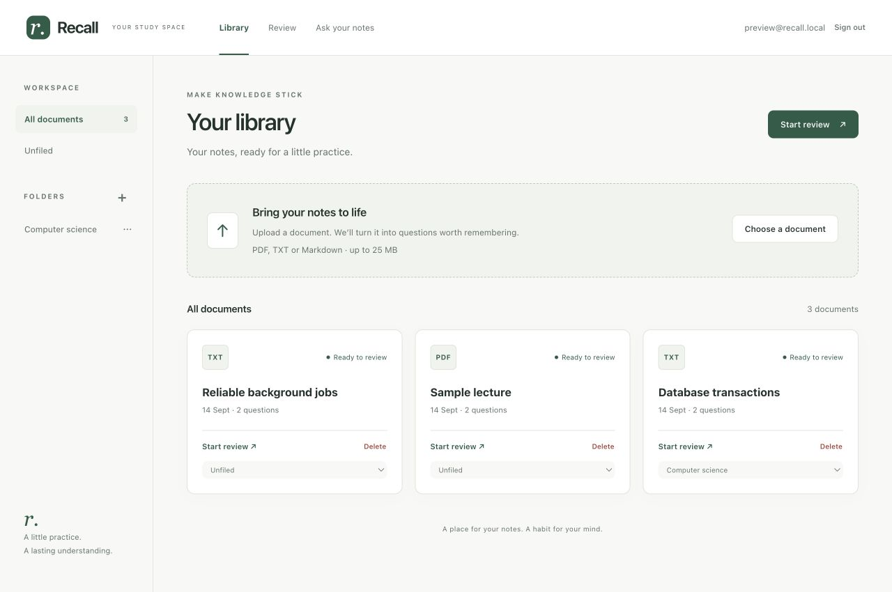

# Recall

[](https://github.com/thenuwij/recall/actions/workflows/ci.yml)


Recall turns your notes into practice questions and schedules reviews using spaced repetition. Answer in your own words, get feedback against the source passage, and return to the original PDF when you need more context.



## Try Recall

Open [Recall](https://recall.thenujawijesuriya.com), create an account, or choose **Explore the demo** on the sign-in screen.

The demo account is `demo@recall.app` / `recalldemo123`. It includes practice questions and allows one PDF upload of up to 10 pages. Answers are graded but review progress is not saved. Folder editing requires your own account so the shared demo stays consistent.

## Features

- **Study your own material:** upload PDF, text or Markdown notes to generate Q&A cards.
- **Organise by topic:** create folders, move documents, and review a folder or a single document. Due reviews take priority over new cards.
- **Understand your answers:** see a grade, explanation, suggested answer and highlighted source excerpt after each response.
- **Read the original:** open uploaded PDFs with page navigation and zoom. Source feedback links to the relevant PDF page.
- **Build a review habit:** SM-2 schedules the next review from your answer grade.
- **Ask your notes:** ask a question and get an answer from the most relevant passages in your library, with citations. If your notes don't cover it, Recall says so instead of guessing.

The interface adapts to phone, tablet and desktop, and follows your system's light or dark appearance.

Scanned or image-only PDFs aren't supported yet — run them through OCR before uploading.

## Run locally

You need Docker and an OpenAI API key. Go, Postgres, Redis and PDF text extraction run in containers.

```sh
git clone https://github.com/thenuwij/recall.git
cd recall
cp .env.example .env
```

Set `OPENAI_API_KEY` in `.env`, then start the app:

```sh
docker compose up --build
```

Open [localhost:8090](http://localhost:8090), create an account and upload a document. The Library shows processing status and the number of generated questions. Open Review when they are ready.

`docker compose down` stops the services. Adding `-v` also deletes the database volume and its uploaded files.

## Architecture

Two Go binaries share one Postgres database: the API serves the embedded frontend and grades answers, and a small worker pool handles embeddings and question generation. PDF.js is bundled locally to render original PDFs.

```text
Browser → API ── documents, jobs, reviews ──→ Postgres
           │                                     ▲
           │                                     │ claim jobs, save results
           │                                     │
           └──→ Redis Streams ── wake-up ──→ Worker ── embeddings, questions ──→ OpenAI
```

Postgres owns job state. A job is saved in the same transaction as its document, and Redis only wakes a worker, so jobs still run while Redis is unavailable. Workers claim jobs with `FOR UPDATE SKIP LOCKED` and hold a renewable lease. If a worker crashes, its job is claimed again, and the old worker cannot overwrite the new result. Temporary OpenAI errors retry with backoff before a job is marked failed.

Each card points to the passage it was generated from, and answers are graded against that passage. Model responses with invalid scores or unknown sources are rejected. Original PDFs are stored in Postgres and served only to their owner.

Ask uses retrieval-augmented generation (RAG). Your question is embedded, pgvector finds the closest passages, and the model answers only from those passages with citations. If no passage is close enough, Recall refuses rather than generating an answer.

## Testing

With Go installed:

```sh
go test -race ./...
```

Tests that need Postgres, Redis or `pdftotext` are skipped when those are not available. CI runs the full suite with all of them on every push.

## Deployment

The hosted app runs on a single AWS Lightsail instance using the same Compose services, with a production overlay that adds Caddy for HTTPS and keeps Postgres, Redis and the API off the public internet.

The database is [backed up](scripts/backup.sh) nightly to a private S3 bucket, including original PDFs. A [restore drill](scripts/restore-drill.sh) restores the latest backup into a temporary database and checks that every table matches.

## License

[MIT](LICENSE). Bundled PDF.js and its supporting assets retain their [upstream licenses](internal/web/static/vendor/pdfjs/LICENSE).
